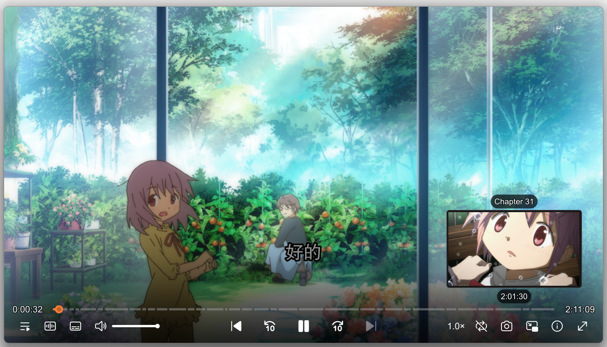
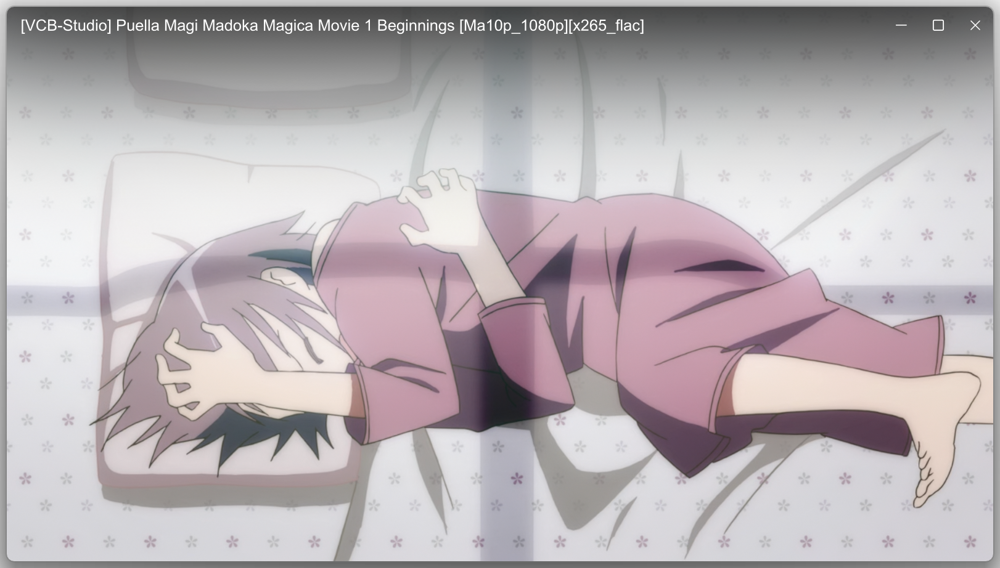

# MPV ModernZ Optimized 极简高画质懒人包

这是一个为 MPV 播放器打造的**开箱即用、高画质沉浸式无边框**配置懒人包。基于现代化界面 `ModernZ` 与进度条预览 `thumbfast` 深度调优，解压即用。

---

## 📸 效果预览

````carousel

<!-- slide -->

````

---

## ✨ 核心优化

相比 ModernZ 原版，本懒人包进行了以下精简实用的细节优化：

1. **重构全屏控件比例**：缩减了右上角窗口控制按钮（最小化/最大化/关闭）的默认尺寸，视觉效果精致协调。
2. **完美悬浮无边框**：无边框，windows11窗口风格，阴影圆角层次感鲜明。
3. **OSD 视觉对称平衡**：对 ModernZ 界面排版调整，使播放按钮及两侧功能图标位置更协调均衡。
4. **新增操作中文反馈**：鼠标点击截图、置顶、循环、变速按钮时，界面会弹出中文提示，交互更清晰。

---

## 🚀 使用方法

本配置包为**免安装绿色懒人包**，只需两步即可完美使用：

1. **解压存放**：将下载好的懒人包整体解压到您想要存放的本地目录。
2. **一键注册关联**：
   * 右键点击目录下的 [mpv-register.bat](./mpv-register.bat)，选择 **“以管理员身份运行”**，即可自动将音视频文件关联至 MPV。
   * **如何卸载**：如果后续需要移动或删除播放器，右键运行 [mpv-unregister.bat](./mpv-unregister.bat) 即可一键彻底清除系统关联。

---

## ⚙️ 硬件与画质个性化调优

您可以打开 [mpv.conf](./mpv.conf) 进行微调，文件内已为您清晰标注：
* **「🚫 协同 ModernZ 核心配置，请勿修改」**：这部分是保持 ModernZ 无边框界面正常运转的基石，修改可能导致界面重叠或白边闪烁。
* **「⚙️ 可根据显卡与 CPU 性能灵活调配」**：低配/核显用户保持默认即可；如果您拥有高性能独显（如 NVIDIA RTX 独显），可在此区域自行开启更高端的图像放大算法（如 `ewa_lanczos`）。